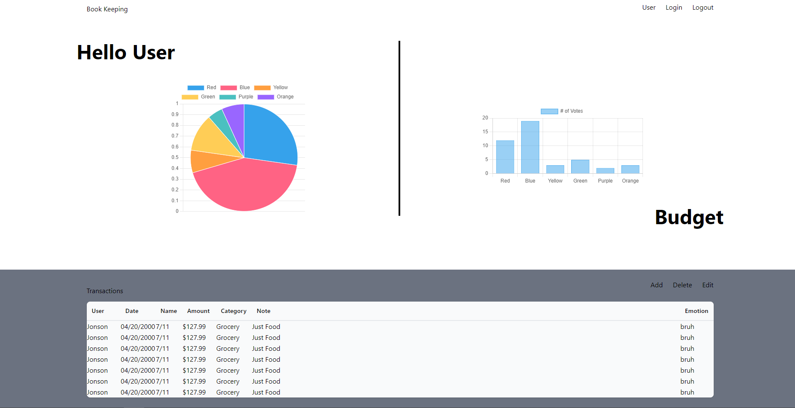

# Budget tracker

## Description

This web application is created to provide a user access to a budget tracker. The user is able to see charts of their spending and the amount of money left.

## Table of contents

- [Installation](#installation)
- [Usage](#usage)
- [Credits](#credits)
- [License](#license)
- [Feature](#features)
- [Wishlist](#wishlist)

## Installation

To install this web application, you will need to have VScode install. You then run npm install in your terminal and then npm start to start the server.

## Usage

The budget tracker website can be found here: 

To use this application, you will need to create an account. Once the account is create, you will be able to go to the bookkeping page, and add your spendings and income. Some graph will show up and help you see where your money goes to.

## Credits

Constributors:

[Chad](https://github.com/APOLAKl)

[Jonson](https://github.com/StunnaDawg)

[Noah](https://github.com/noahbeaton)

[Valeri](https://github.com/Valerigionetnoel)

## License

Refer to license in repo for more information.

## Feature

Some features of this application are:

- Easy to see where your hard earn money goes to.
- You can see your past month spendings.
- You can see all your transactions.

## Wishlist
